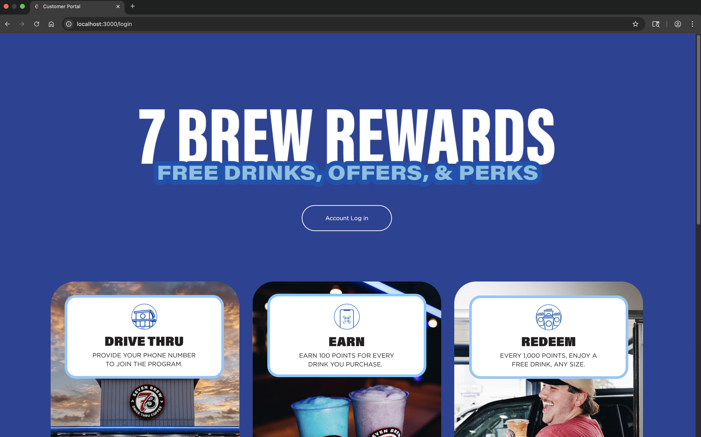
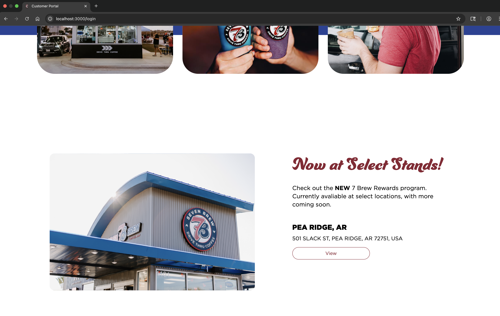

# ☕ 7 Brew Rewards Program Website

This project was developed during my Summer 2025 internship as a **Software Developer Intern at 7 Brew Coffee**. It is a full-stack web application that allows thousands of customers to earn, track, and redeem loyalty points. I built the site from scratch and integrated it with the company's backend systems using REST APIs.

> 🔒 Note: Screenshots and sample data have been anonymized to respect company privacy.

---

## 🚀 Features

- Points tracker
- Purchase history
- Login & authentication system
- Check gift card balance
- Real-time backend integration with 7 Brew’s customer data via  FastAPIs

---

## 🛠️ Built With

- **Frontend:** Vue.js, Nuxt.js, Tailwind CSS, HTML, JavaScript, TypeScript  
- **Backend:** Python, FastAPI, Node.js  
- **Authentication:** Auth0  
- **Other Tools**: Git, Figma (mockups), Postman & HTTPie (API testing)

---

## 📸 Screenshots

### 🏠 Login Page  

### 📋 Customer Dashboard  

### 🎁 Rewards Page  

